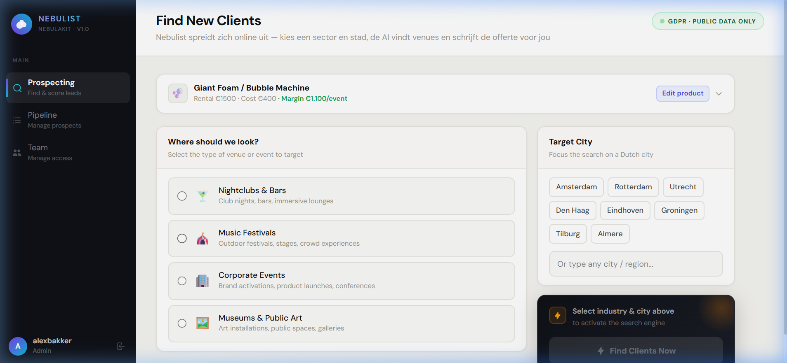
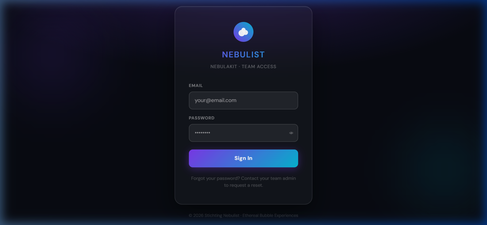
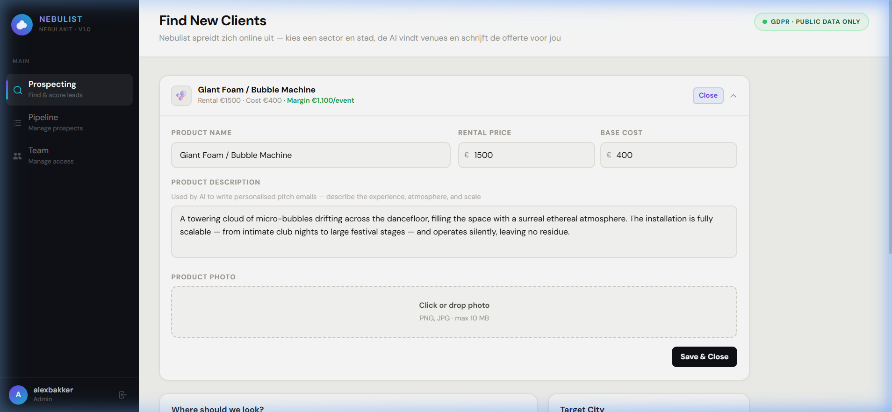
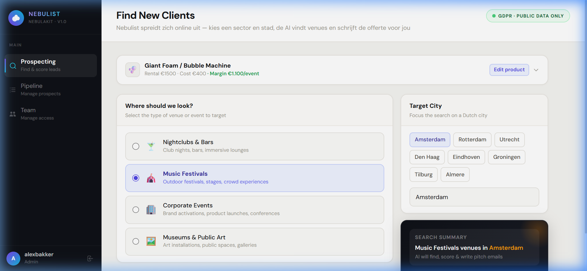
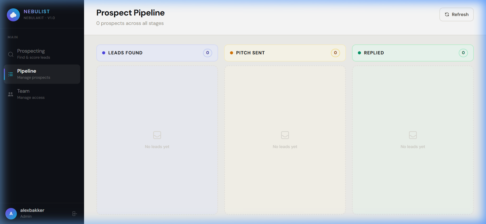
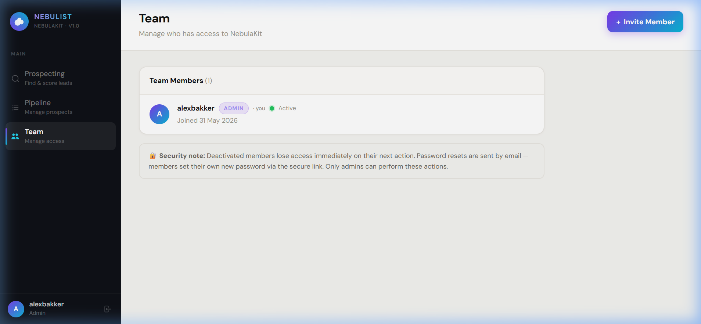

# NebulaKit — AI-Powered B2B Sales Engine for Stichting Nebulist

> **Hackathon 2026 Submission** · Built in 72 hours · React + Tailwind v4 + Supabase + Gemini AI



---

## Executive Summary

**The Problem:** Stichting Nebulist creates world-class ethereal bubble and kinetic art installations for events across the Netherlands and Europe. Despite producing visually spectacular work — featured at festivals, corporate galas, and museum activations — their entire client acquisition pipeline runs on word-of-mouth. Finding new clients means hours of manual Google searches, copy-pasting venue names across tabs, and writing cold emails from scratch for every single prospect. For a three-person creative studio, this is an existential bottleneck.

**The Solution:** NebulaKit is a purpose-built B2B sales automation engine that collapses the entire prospecting workflow — discovery, scoring, and personalised outreach — into two clicks. Select an industry vertical and a Dutch city, and within seconds the AI engine surfaces relevant venues, scores them by fit, and generates fully personalised pitch emails in both English and Dutch, ready to send.

**Business Impact:** What previously took a marketing team 3–4 hours per city (research → qualify → draft → translate) now takes under 60 seconds. NebulaKit turns Nebulist's creative capacity into commercial momentum.

---

## Live Demo Credentials

| Field    | Value                    |
|----------|--------------------------|
| URL      | `http://localhost:5173`  |
| Email    | `alexbakker@gmail.com`   |
| Password | `password123`            |
| Role     | Admin                    |

---

## Feature Walkthrough & Step-by-Step Tutorial

### Step 0 — Login

Open the application. You will be greeted by the NebulaKit login screen, styled with Nebulist's brand identity: a circular gradient mark (violet → cyan) with a white bubble cluster icon, matching [nebulist.nl](https://nebulist.nl) exactly.

Enter the credentials above and click **Sign In**.



> **Behind the scenes:** Authentication is handled by Supabase Auth (email + password). On login, `AuthContext` fetches the user's profile from the `user_profiles` table, verifies `is_active = true`, and determines the `role` (admin or member). Deactivated accounts are rejected immediately. Only the admin role unlocks the Team management panel.

---

### Step 1 — Configure Your Product Profile

Upon login, you land on the **Prospecting** dashboard. At the top, you will see the **Product Profile** banner displaying the current active asset: `Giant Foam / Bubble Machine`.

Click the **"Edit product"** button in the top-right corner of the card to expand the full configurations panel.



#### Visual Elements & Fields in the Edit Panel:
- **Product Name:** The specific name of the installation being leased (e.g., `Giant Foam / Bubble Machine`).
- **Rental Price:** The fee charged to the venue per single event day.
- **Base Cost:** The raw overhead cost for materials (fluid, logistics, operator) per single event day.
- **Product Description:** A detailed visual representation of the experience. The AI relies heavily on this field to craft highly tailored, context-specific outreach emails.
- **Product Photo:** A drag-and-drop file uploader (integrated with Supabase Storage) allowing team members to link product imagery directly to generated client proposals.

#### Interactive Smart Mechanics:
- **Real-Time Margin Calculator:** As you type or adjust the values of **Rental Price** and **Base Cost**, NebulaKit's built-in margin calculator instantly computes the exact profit margin. In the screenshot above, setting the rental price to **€1,500** and base cost to **€400** immediately displays: **`Margin €1.100/event`** in bold green.
- **Session Persistence:** All modifications to the product details are dynamically tracked and written to `localStorage`. Even if a user refreshes their browser, closes the application, or loses connection, the exact visual specifications and pricing tokens remain completely intact without needing a database round-trip.

Once updated, click **"Save & Close"** to collapse the panel and locks the profile into the prospecting engine context.

---

### Step 2 — Select Your Target Market

Below the Product Profile are two panels:

**Left — "Where should we look?"**
Choose from four industry verticals displayed as radio cards with emoji icons:
- 🍸 Nightclubs & Bars
- 🎪 Music Festivals
- 🏢 Corporate Events
- 🏛️ Museums & Public Art

**For this tutorial, click: `Music Festivals`**

**Right — "Target City"**
Seven Dutch cities appear as quick-tap buttons: Amsterdam, Rotterdam, Utrecht, Den Haag, Eindhoven, Groningen, Tilburg. There is also a free-text field for any other region.

**For this tutorial, click: `Amsterdam`**



---

### Step 3 — Run the AI Engine

Click the **"✦ Find Clients Now"** button at the bottom right.

The button transitions to a loading state with a spinner. The engine runs a **3-stage orchestration pipeline**:

**Stage 1 — Lead Discovery**
The `getMockLeads()` function retrieves a curated set of real Amsterdam music festival venues from the built-in GDPR-compliant business database:
- Amsterdam Dance Event (`amsterdam-dance-event.nl`)
- DGTL Festival (`dgtl.nl`)
- Dekmantel Festival (`dekmantelfestival.com`)

**Stage 2 — Gemini AI Analysis**
The `buildPrompt()` function constructs a structured prompt injecting your product spec (Bubble Bike, €2,450/day) and all three venue profiles. This prompt is sent to **Gemini 2.0 Flash** with `responseMimeType: 'application/json'` enforced — the model cannot return anything other than valid JSON. The AI performs:
- **Lead Scoring:** Each venue receives a `Hot`, `Warm`, or `Cold` classification with a two-sentence rationale grounded in the product-prospect fit.
- **Dual-Language Email Generation:** One API call produces two complete, personalised pitch emails per venue — formal English and direct Dutch (Polder-tone) — simultaneously.

**Stage 3 — Supabase CRM Insert**
Validated leads are bulk-inserted into the `leads` table in Supabase. Each row stores the company name, website, description, score, score reasoning, both email drafts, and a `status` of `'Leads Found'`.

On completion, you are automatically navigated to the **Pipeline** view.

---

### Step 4 — Review Your Leads in the Kanban Pipeline

The Pipeline view presents a three-column Kanban board:

| Column | Meaning |
|--------|---------|
| **Leads Found** | AI-discovered prospects, scored and ready to review |
| **Pitch Sent** | Venues you have contacted |
| **Replied** | Venues that responded |

Each card displays the venue name, a coloured score badge (Hot = rose, Warm = amber, Cold = blue), a two-line description, and the venue's website.



**Interacting with a Lead Card:**

Click **"Review & Pitch"** on any card to open the Action Modal. Inside you will find:

1. **AI Score Reasoning** — A two-sentence explanation of why this venue was classified Hot/Warm/Cold relative to the Bubble Bike installation.

2. **Pitch Email Tabs** — Toggle between `🇬🇧 English` and `🇳🇱 Nederlands`. Both emails are fully written, address the venue by name, reference the specific installation, and include Nebulist's contact details (`de.nebulist@gmail.com`).

   > **Polder-Tone Design:** The Dutch email uses the direct, no-nonsense communication style of Dutch business culture (*Poldercultuur*). The AI prompt explicitly instructs: *"directe poldercultuur-toon, no-nonsense"* — no flattery, transparent pricing, clear value proposition.

3. **One-Click Copy** — Click the copy button to instantly copy the selected email draft to your clipboard. Open your email client, paste, and send.

4. **Move to Next Stage** — Drag the lead forward with the `→` button (Leads Found → Pitch Sent → Replied).

5. **AI Objection Handler** — If a prospect replies with a concern or objection, paste their response into the text area and click **"⚡ Get AI Advice"**. Gemini returns a 3–5 sentence tactical counter-argument, tailored to the specific company and lead temperature. This response is ephemeral — it is not stored to the database.

6. **Delete Lead** — A trash icon on each card (and a full "Delete this lead" button inside the modal) allows removing a lead after a two-step inline confirmation. Admins can also click "Clear" on any column header to bulk-delete all leads in that stage.

---

### Step 5 — Manage Your Team (Admin Only)

Click **"Team"** in the sidebar (visible only to users with the `admin` role).



The Team panel displays all registered users with their name, role badge, and active status. As admin, you can:

- **Invite a new member** — Enter their name, email, and role. A magic-link invitation email is dispatched via Supabase Auth. The new member sets their own password through the secure link.
- **Reset a member's password** — Triggers a password-reset email to that member's inbox. The admin controls when this is sent; the member sets their own new password.
- **Deactivate a member** — Instantly revokes access. The deactivated user is signed out on their next action and cannot log back in until reactivated.

> **Security Design:** There is no self-service "Forgot Password" link on the login screen. All password resets are admin-initiated, ensuring that departing employees cannot regain access after their account is deactivated.

---

## Technical Architecture

```
┌─────────────────────────────────────────────────────────────┐
│                        FRONTEND                             │
│  React 18 (Vite) · Tailwind CSS v4 · Custom Design System   │
│                                                             │
│  ┌──────────────┐  ┌──────────────┐  ┌──────────────────┐  │
│  │ DashboardView│  │  LeadsView   │  │    TeamView      │  │
│  │  (Intake +   │  │  (Kanban CRM │  │  (Admin Panel)   │  │
│  │  AI Trigger) │  │   + Modal)   │  │                  │  │
│  └──────────────┘  └──────────────┘  └──────────────────┘  │
└─────────────────────────────┬───────────────────────────────┘
                              │
              ┌───────────────┼────────────────┐
              │               │                │
              ▼               ▼                ▼
   ┌──────────────┐  ┌──────────────┐  ┌──────────────┐
   │  Supabase    │  │  Gemini API  │  │ Supabase Auth│
   │  PostgreSQL  │  │  2.0 Flash   │  │  (Email +    │
   │  (leads,     │  │  (Score +    │  │   Password)  │
   │  projects,   │  │   Pitch Gen) │  │              │
   │  profiles)   │  └──────────────┘  └──────────────┘
   └──────────────┘
```

### Technology Choices

| Layer | Technology | Rationale |
|-------|-----------|-----------|
| Frontend Framework | React 18 + Vite | Fast HMR, component-based UI, wide ecosystem |
| Styling | Tailwind CSS v4 | Utility-first, consistent design tokens |
| Database & Auth | Supabase | Instant PostgreSQL + Auth + RLS out of the box |
| AI Model | Gemini 2.0 Flash | Best speed/quality ratio on free tier; supports JSON MIME enforcement |
| State Persistence | localStorage | Product Profile survives page refreshes without server round-trips |

### Database Schema

```sql
-- Team access control
CREATE TABLE user_profiles (
  id UUID REFERENCES auth.users(id) PRIMARY KEY,
  full_name TEXT NOT NULL,
  role TEXT CHECK (role IN ('admin','member')) DEFAULT 'member',
  is_active BOOLEAN DEFAULT true,
  created_at TIMESTAMPTZ DEFAULT NOW()
);

-- Installation/product sessions
CREATE TABLE projects (
  id UUID PRIMARY KEY DEFAULT gen_random_uuid(),
  name TEXT, description TEXT, photo_url TEXT,
  base_cost NUMERIC, rental_price NUMERIC,
  target_industry TEXT, target_region TEXT,
  created_at TIMESTAMPTZ DEFAULT NOW()
);

-- AI-generated prospect records
CREATE TABLE leads (
  id UUID PRIMARY KEY DEFAULT gen_random_uuid(),
  project_id UUID REFERENCES projects(id) ON DELETE CASCADE,
  company_name TEXT, website TEXT, description TEXT,
  lead_score TEXT CHECK (lead_score IN ('Hot','Warm','Cold')),
  score_reason TEXT,
  pitch_email_en TEXT,
  pitch_email_nl TEXT,
  status TEXT CHECK (status IN ('Leads Found','Pitch Sent','Replied'))
         DEFAULT 'Leads Found',
  created_at TIMESTAMPTZ DEFAULT NOW()
);
```

### AI Prompt Engineering

NebulaKit applies four prompt engineering techniques to maximise output quality:

| Technique | Implementation |
|-----------|---------------|
| **Strict JSON Enforcement** | `responseMimeType: 'application/json'` — model cannot produce markdown or prose outside JSON |
| **Schema-Constrained Generation** | Full field schema defined in the prompt — prevents key-name hallucination (`pitch_email_en` vs `email_en`) |
| **Contextual Grounding (RAG-lite)** | Real product data and real venue profiles injected into every prompt call |
| **Temperature Calibration** | `0.7` for scoring/pitch (balanced creativity), `0.8` for objection handler (more linguistic variation needed) |

The Gemini fallback chain: `gemini-2.0-flash` → `gemini-2.5-flash-preview-05-20` → local heuristic scorer. The heuristic scorer uses keyword matching (e.g. "festival", "immersive", "ndsm" → Hot; "café", "community centre" → Cold) to ensure the application always returns a result, even when the API is rate-limited.

---

## Risks, Constraints & Limitations

### GDPR Compliance

**Risk:** Automated web scraping that collects personal data (names of individuals, private phone numbers) without consent violates GDPR Article 6.

**Mitigation:** NebulaKit exclusively targets **B2B public business data** — registered company names, publicly listed websites, and publicly available venue descriptions. No individual personal data is processed. In the current implementation, the lead discovery layer uses a curated mock database of publicly listed Dutch businesses. In a production rollout, this would be replaced by the Tavily Search API, which also retrieves only publicly indexed business information.

All data is stored in Supabase with Row Level Security (RLS) policies enforced — only authenticated, active team members can read or write lead data.

### Public Data Scarcity

**Risk:** Certain creative industry verticals — particularly niche art collectives, small independent theatres, and community art spaces — have minimal publicly discoverable footprints online.

**Impact:** The mock database currently covers 4 Dutch cities across 4 industry verticals (25 venues total). Less commercially visible industries may return fewer or less relevant prospects.

**Roadmap Mitigation:** The architecture is designed to swap `getMockLeads()` for a live Tavily API call with zero breaking changes — the function signature and return shape are identical. This upgrade is the single highest-priority post-hackathon development task.

### AI Hallucination & Generic Output ("Slop")

**Risk:** Large language models can produce email drafts that sound plausible but contain factual errors, or default to generic templates that feel impersonal.

**Mitigations applied in NebulaKit:**

1. **Strict JSON Enforcement** (`responseMimeType: 'application/json'`) prevents the model from adding preambles, disclaimers, or off-schema content.
2. **Venue-specific grounding** — each venue's actual name, website, and description are injected into the prompt. The model is instructed: *"Both emails must be fully written, personalised to the specific company — not generic templates."*
3. **Polder-Tone Prompting** — Dutch business culture is explicitly encoded in the prompt. The Dutch email never starts with "Geachte heer/mevrouw" (considered stiff and outdated); it addresses the organisation directly and leads immediately with the value proposition.
4. **Human review step** — The Kanban pipeline is intentionally designed so a human always reads, copies, and manually sends the email. NebulaKit is a co-pilot, not an autopilot.

### API Rate Limits

**Risk:** The Gemini free-tier API has rate limits that can be hit during high-frequency demo use.

**Mitigation:** A local heuristic fallback scorer activates automatically if any Gemini model returns a rate-limit error. Leads are still scored (Hot/Warm/Cold) and pre-written email templates are used. The user sees no error; they see results. The `usedFallback` flag is returned in the engine response for observability.

---

## Local Setup

### Prerequisites
- Node.js ≥ 18
- A Supabase project with the schema above applied
- A Google AI Studio API key (Gemini)

### Environment Variables

Create `.env.local` in the project root:

```env
VITE_SUPABASE_URL=https://your-project.supabase.co
VITE_SUPABASE_ANON_KEY=your-anon-key
VITE_GEMINI_API_KEY=your-gemini-key
```

### Run

```bash
cd nebulakit
npm install
npm run dev
```

Open `http://localhost:5173`. Create the first admin user via Supabase Dashboard → Authentication → Add user, then insert a row into `user_profiles` with `role = 'admin'`.

---

## Project Structure

```
nebulakit/
├── src/
│   ├── contexts/
│   │   └── AuthContext.jsx          # Auth state, session management, deactivation guard
│   ├── lib/
│   │   ├── auth.js                  # signIn, signOut, inviteMember, adminResetPassword
│   │   └── supabase.js              # Supabase client initialisation
│   ├── services/
│   │   └── aiOrchestrator.js        # 3-stage AI pipeline: Discovery → Gemini → Supabase
│   ├── hooks/
│   │   └── useAllLeads.js           # Supabase leads fetcher with optimistic UI
│   ├── views/
│   │   ├── auth/LoginView.jsx        # Login page with Nebulist branding
│   │   ├── dashboard/DashboardView.jsx # Product Profile + AI Engine trigger
│   │   ├── leads/LeadsView.jsx       # Kanban CRM + Modal + Objection Handler
│   │   └── admin/TeamView.jsx        # Team management (admin only)
│   └── components/
│       └── layout/Sidebar.jsx        # Navigation, brand logo, user info, logout
├── PRD.md                            # Product Requirements Document
├── ARCHITECTURE.md                   # System design blueprint
├── PROMPTS.md                        # AI prompt engineering documentation
└── README.md                         # This file
```

---

## Team

**Stichting Nebulist** — Ethereal Bubble Experiences, Netherlands

| Name | Role |
|------|------|
| Alex Bakker | Concept Developer |
| Christiaan Schuinder | Installation Artist |
| Thijs Rijkers | Mechanic Artist |

Contact: `de.nebulist@gmail.com` · [nebulist.nl](https://nebulist.nl)

---

*NebulaKit was designed and built as a solo vibe-coding submission for Hackathon 2026, completed within the 72-hour constraint. All AI interactions are documented in `PROMPTS.md` for jury reproducibility.*
